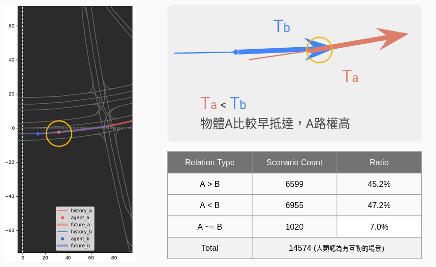
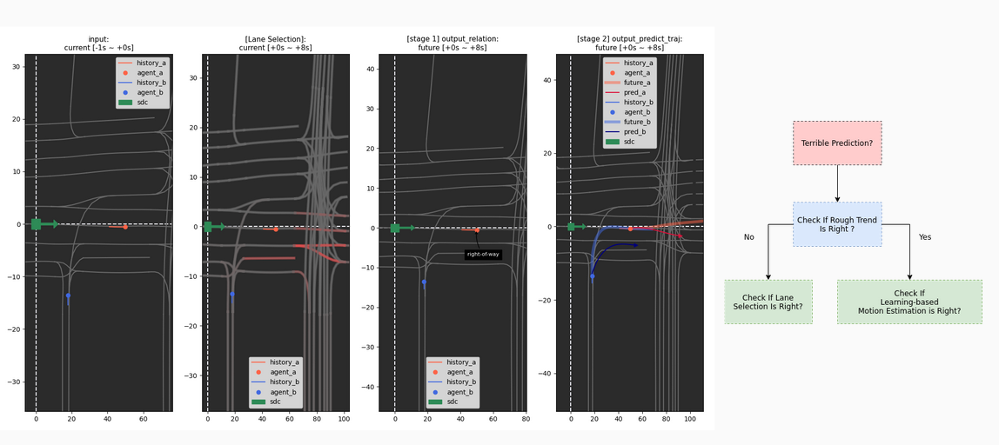

# Joint and Conditional Prediction in Urban Scenario
### 1. Mixed hand-craft & learning-based method to handle interaction explicitly.
### 2. Trajectory prediction conditioned on influencer in trajectory-level.


For more, please refer to [slides](https://docs.google.com/presentation/d/1b92Jj9EWcSuPht7dAi2BjzrmcTaTlChVu2aPBpPjxzY/edit#slide=id.g1332873914f_56_45)

---

## Introduction
### Environment setup
Use [conda](https://docs.anaconda.com/anaconda/install/index.html) to set up a virtual environment for python package management is recommended, a docker file will be provided in future.
First create an environment with python==3.7.1
```
conda create --name [environment name] python=3.7.1
```
then use pip to install all the package needed
```
pip install -r requirements.txt
```

### Dataset preparation
Follow official download tutorial [Waymo Open Motion Dataset](https://waymo.com/open/data/motion/)
- In our work, we especially focus on interactive pairs.

---

## Method : 
### Input data processing
- Vector-based
    - Targets Motion Encoding
    - Semantic Map Encoding : Lane, Traffic Lights
    - Sharing Frame (sdc-centric)
        - Integrate the concept of rasterized-based method
        - Encode every agents and map features in the same coordinate
### Model


- Encoder-Decoder Structure
    1. Task on encoder：Convert input data to high dimentional feature domain.
    2. Task on attention layer：Feature fusion statge → lane searching
    3. Task on relation predictor： Predict relation type between interaction pairs.
    4. Task on trajectory predictor： Maintain two stage predictor to generate trajectory pair controlled by high-level interaction type.

### Loss Function :    
$$
L_i(w) = \lambda L^{Relation}_i(w)  + L^{ADE}_i(w) 
$$
#### Multi-task Learning + Supervised Learning
#### Relation Loss : Cross Entropy
- Ground-truth : 3 cases (self-label) 
- A > B
- A < B
- A ~= B
#### ADE Loss : Average Distance Loss
- Ground-truth : Future Tracks

---

## How to label relation type



---

## Others
### Visualization Tool


---

## To-do
- [ ] Extend to Kung-Fu road data
- [ ] Extend to handle multiple agents (more than interactive pairs)
- [ ] Animation tool
